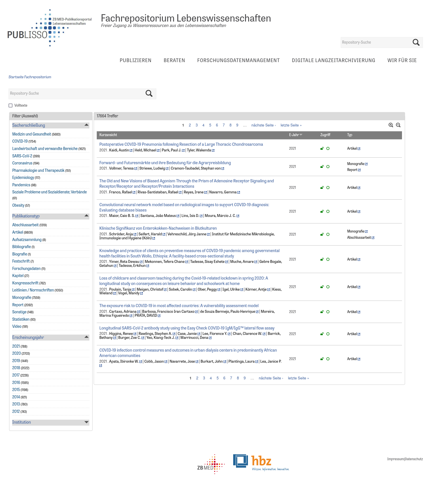

# About

zbmed-drupal-theme is a Drupal theme based on Bartik. It must be used with the [to.science.drupal Modules](https://github.com/hbz/to.science.drupal)

# Installation

Clone the repository to Drupal's theme directory:

    $ cd sites/all/themes
    $ git clone https://github.com/hbz/zbmed-drupal-theme.git

Activate "Edoweb" theme at (e.g. at
<http://localhost/drupal/?q=admin/appearance>).
